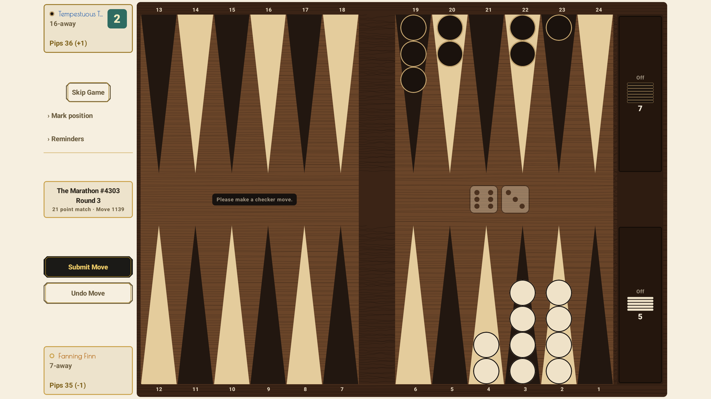
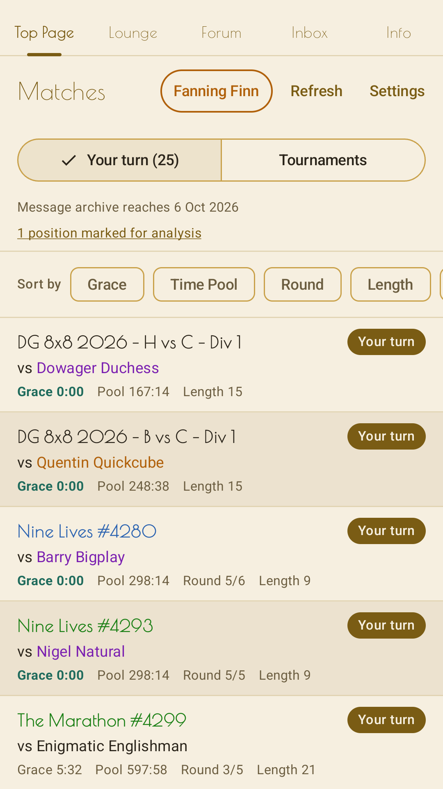
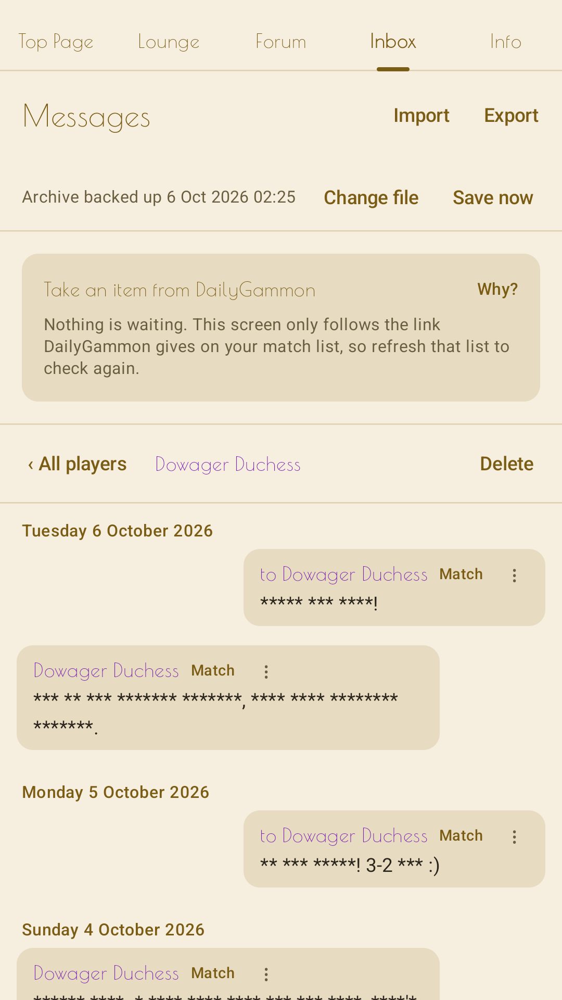

# DG Android

An unofficial Android client for [DailyGammon](http://www.dailygammon.com/), the
turn-based backgammon site that has been running since 2001. The site has no public API,
so the app signs in with your own account and reads the same HTML pages a browser would.
It is not affiliated with DailyGammon.

The app is written in Kotlin with Jetpack Compose and has no third-party SDKs: no
analytics, no ads, no crash reporting. It talks to `dailygammon.com` and to nothing else.
Its privacy policy is at <https://tommihaa.github.io/dg-android-privacy/>.

## Screenshots

A board on a Samsung tablet (SM-T970) with the Walnut look, and the match list and the Inbox on a
Pixel 8a, from version 1.1. The pictures follow your light or dark mode. Player names and
messages are made up for these pictures.

<picture><source media="(prefers-color-scheme: dark)" srcset="docs/kuvat/kauppa/tabletti-2-lauta-tumma.png"></picture>

<picture><source media="(prefers-color-scheme: dark)" srcset="docs/kuvat/kauppa/puhelin-1-luettelo-tumma.png"></picture>
<picture><source media="(prefers-color-scheme: dark)" srcset="docs/kuvat/kauppa/puhelin-4-inbox-tumma.png"></picture>

## Why it exists

Two things separate it from playing in a browser or in DG Mobile, and they are the reason
the project was started.

**Your messages are kept on this device.** DailyGammon's own help says it plainly:
*"Messages are not saved on this server."* Every message is shown once and then gone. The
app saves each one before it appears on screen, so the conversation of a match survives.
Moves survive on the site anyway; the app stores exactly the half the site does not.

**A dropped connection does not sign you out.** The session is renewed quietly, a cold
start in flight mode opens signed in, and a board already loaded stays on screen across the
gap.

## What else is different from the site

This list is the same as the *What is different from the DailyGammon site* group in the
app's own Help screen, which is kept in step with the code by a test.

- You can sort the match list your way.
- Your taps stay on this device until you press Submit Move.
- The app can place checkers for you (forced plays and greedy bear-off), but never sends
  them.
- A tournament row names the opponent and the round.
- You can filter, export, back up and import your archive.
- Each DailyGammon account on this device has its own archive.
- Reminders for a game live on this device.
- The board can look different from the browser.
- Join, Sign up, Double, Accept and forum posts ask you to confirm first.
- You can mark a position to look at after the match, and share the match as `.mat` or as
  `.sgf` for GNU Backgammon and BGBlitz.
- The board tells you when an action may not have arrived.

## What the app never does

It never sends anything to DailyGammon without a press of yours. It never fetches in the
background: no timer, no notifications. It reads only the pages you open, plus your own
settings page once at startup. It keeps what it keeps on this device only.

## How it was built

This is a one-person project, built daily with Claude Code since late July 2026. The code,
the documents under `docs/` and the commit messages were written together. The decisions are
the author's, and they are recorded before the code that follows from them.

What keeps that honest is the checking rather than the writing. The parsers run under JUnit
against saved copies of real DailyGammon pages, 76 of them at the time of writing. Every
change runs the tests before it counts as done. Behaviour on the device is measured with a
logging proxy and screen captures rather than assumed from the code. Solutions that were
tried and rejected are written down with the reason, in `docs/` where they concern the site
and in the private working notes where they concern the author.

The measurement tools are in `tyokalut/`. `proxy.py` saves every page the tablet fetches
during a session, `sessio.py` runs the whole chain (proxy, device setting, screen recording,
verification, teardown), `synvahti.py` watches the TCP handshake to the site, `kehysdiff.py`
and `sidonta.py` bind taps, requests and frames into one timeline, and `kuoriproxy.py` answers
the device from saved pages so that a site setting can be tried without touching the account
or the site. The docstrings are in Finnish, the command lines are not.

## Building

Requirements: JDK 21 and the Android SDK (API 36). Android Studio's bundled JDK works.

```
gradlew :app:assembleDebug
```

`sdk.dir` goes in `local.properties`, written with forward slashes (see
`local.properties.example`). A signed release build needs `keystore.properties`; see
`keystore.properties.example`. Neither file is versioned.

Tests run without a device or network:

```
gradlew test
```

The `core-*` modules are plain JVM Kotlin on purpose: the HTML parsing, which is where the
risk is, runs under JUnit against saved copies of real pages. The `data` module runs Room
under Robolectric.

`gradlew :core-net:liveTest` runs against the real site and needs credentials in
`local.properties`. Note that DailyGammon has no HTTPS at all, so the password travels
unencrypted, in this app exactly as in a browser.

## Layout

| Module | Type | Contents |
|---|---|---|
| `core-domain` | JVM | Models. No dependencies, no knowledge of the network or of HTML. |
| `core-scrape` | JVM | Jsoup parsing and page recognition. |
| `core-net` | JVM | OkHttp, cookie storage, session renewal. |
| `data` | Android | Room: message archive, outgoing action queue, reminders and marks. |
| `app` | Android | Compose UI, sign-in and the match list. |

The documents under `docs/` are the project's working notes and are in Finnish. They hold
what was measured about the site (`KOHDE.md`), how the modules fit together
(`ARKKITEHTUURI.md`), the screens (`UI.md`) and how the Help screen is kept truthful
(`OHJE.md`). Comments in the code and in these documents also point to files that are
not in this repository (`SUBSTANSSI.md`, `AVOIMET.md` and others): those are the private
working notes, and the pointers are left as they are rather than rewritten.

## Reading the code

The app holds your DailyGammon password and your messages, and Google Play's review does
not read the code. Anyone can, and if you find something that should not be there, please
tell the other players as well as me.

The code comments are in Finnish. They are long on purpose: most of them say why the code
does what it does, and the reason is usually something measured on the site. Pasting a
file into a translator or a language model gives a readable English version.

A few files carry the main ideas, and their opening comments are the place to start:

| File | What it holds |
|---|---|
| `core-scrape/.../DgPages.kt` | Page recognition. A signed-out request returns 200 OK and the login form, so the app decides from the content what page it got, never from the status code. |
| `core-net/.../DgClient.kt` | The only way out to the network. It signs in again silently when the session has expired and keeps a minimum gap between requests to be polite to a small site. |
| `core-scrape/.../ChatParser.kt` | The chat after a move: the page the whole app exists for, since the opponent's message is shown only here and the site does not keep it. |
| `data/.../MessageArchive.kt` | A fetched message reaches the screen only through the archive, after it has been saved. Fetching is destructive, so showing first and saving later could lose a message. |
| `core-domain/.../BoardState.kt` | The board at one moment, read from the page and not computed. Move codes come from the page's own links. |
| `core-domain/.../LocalComposition.kt` | Building a move on the device and going to the network only at `Submit Move`. |

The parsers are tested against saved copies of real pages in
`core-scrape/src/test/resources/fixtures/`, and those tests are often the quickest way to
see what a parser expects.

## Status

In a closed test on Google Play since 1 October 2026. The current version is 1.2. Google
lets a new developer's app into the store only after a closed test, so testers are welcome:
how to join is on the [test page](https://tommihaa.github.io/dg-android/).

There are no release builds here. If you build it yourself, you are using your own
DailyGammon account through an unofficial client, at your own risk.

## License

GPL-3.0. See `LICENSE`.
